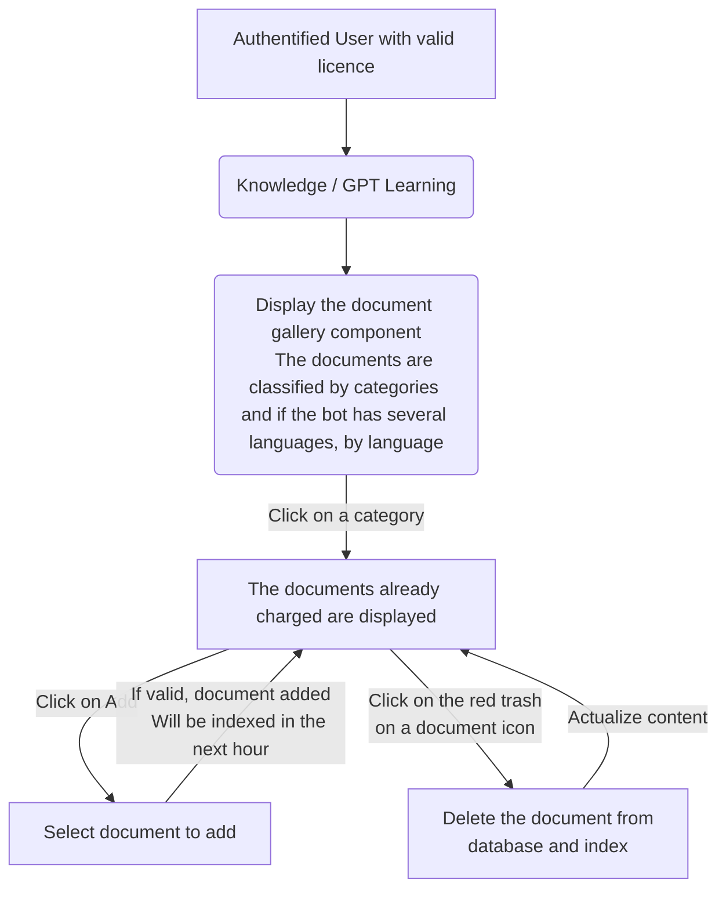

# Semantic Indexing V3 Functional Documentation

## Objectives

This feature aims to help users get relevant answers to their questions, even if the information is not in the chatbot's existing knowledge base. Administrators have the ability to add or remove documents to improve the system's understanding.

## Users

- **Administrators:** They can manage the documents for indexing, adding or removing them.
- **Regular Users:** They interact with the system and receive responses.

## Using the Studio

### Document Management

#### How to View Documents

1. Log in as an authenticated user.
2. Access the document gallery component.
3. Documents are organized by categories and languages.
4. Click on a category to see the documents within it.

  

  

#### Adding a Document

1. Click on a category.
2. Select "Add."
3. Choose the document to upload.
4. If successful, the document will be indexed within an hour.

  

#### Deleting a Document

1. Click on the red trash icon next to a document.
2. Confirm deletion to remove the document from the database and index.

  

### Technical Overview

#### Retrieving Documents

- When a user requests documents, the system retrieves them from storage.

#### Uploading Documents

- Users can upload documents, and the system stores them in a secure blob storage.
- Azure Search AI checks for new documents every hour and adds them to the index.

#### Deleting Documents

- Deleting a document triggers removal from storage.
- The document is also removed from the Azure Search AI index.

## Semantic Indexing API

### Overview

#### User Interaction

1. An authenticated user asks a question.
2. If the chatbot can't answer, it checks the API for relevant information in indexed documents.
3. The system presents the answer from the documents or notifies the user that no pertinent answer was found.

mermaid
graph TD
    A[Authentified User with valid licence] --> Z(Talk to the bot, ask a question without response)
    Z --> C(If the bot escalation is configured to fetch the API, it does,
    and answer the question asked with the relative data found in indexed documents)
    C --> E(The bot call the API and wait for a response)
    E --> | The api send back a response containing an answer | X( The answer is displayed into an adaptive card )
   E --> | The api send back a response with no answer | S( A generic message is displayed to inform
   the user no pertinent answer could be found )

#### Behind the Scenes

1. The chatbot sends the question to the API.
2. Azure Search AI queries indexed documents.
3. Relevant documents are filtered based on their scores.
4. If there's a promising result, Azure OpenAI helps refine the answer for better user understanding.

## Architecture

  

## Limits

- Document size limit: 10MB.
- Allowed file extensions: .pdf, .docx, .pptx, .txt.
- Total document storage limit: 2GB.
- Only text is indexed; images are not considered.
- Utilizes secure services, including Azure AI Search and Azure OpenAI.

## Security

You automatically benefit from Microsoft-managed encryption-at-rest.

Azure OpenAI is part of Azure AI services. Azure AI services data is encrypted and decrypted using FIPS 140-2 compliant 256-bit AES encryption.

The data is stored in the North Europe zone.

Your prompts (inputs) and completions (outputs), your embeddings, and your training data:

- are NOT available to other customers.
- are NOT available to OpenAI.
- are NOT used to improve OpenAI models.
- are NOT used to improve any Microsoft or 3rd party products or services.
- are NOT used for automatically improving Azure OpenAI models for your use in your resource (The models are stateless, unless you explicitly fine-tune models with your training data).
Your fine-tuned Azure OpenAI models are available exclusively for your use.

The Azure OpenAI Service is fully controlled by Microsoft; Microsoft hosts the OpenAI models in Microsoft’s Azure environment and the Service does NOT interact with any services operated by OpenAI (e.g. ChatGPT, or the OpenAI API).

Data flow :

  

## Resources

- Azure AI search documentation : https://learn.microsoft.com/en-us/azure/search/
- Features of Azure AI search : https://learn.microsoft.com/en-us/azure/search/search-features-list
- FAQ Azure AI search : https://learn.microsoft.com/en-us/azure/search/search-faq-frequently-asked-questions?- source=recommendations
- FAQ Azure Open AI : https://learn.microsoft.com/en-us/azure/ai-services/openai/faq
- Security in open AI : https://learn.microsoft.com/en-us/legal/cognitive-services/openai/data-privacy?context=%2Fazure%2Fai-services%2Fopenai%2Fcontext%2Fcontext
- Microsoft Products and Services Data Protection Addendum (DPA) : https://www.microsoft.com/licensing/docs/view/Microsoft-Products-and-Services-Data-Protection-Addendum-DPA

## FAQ

### What does "indexing" mean ?

It refers to the ingestion, parsing, and storing of textual content and tokens that populate a search index. Indexing creates inverted indexes and other physical data structures that support information retrieval.

### Is my data safe ?

Yes, your data is as safe than with another azure service. Your data is not available to GPT openAI, or to another user. The data is not used to train other models. Azure OpenAI is separate from OpenAI. 

### I have indexed a document containing the answer to a question, but the chatbot doesn't find the answer, why?

If you have indexed documents and the chatbot doesn't respond to a question, even though the answer is in those documents, there are several possibilities:
- The document may not have been indexed yet: wait up to an hour for the indexing to complete.
- The score returned by Azure AI Search may be too low for the answer to be considered. In this case, it is recommended to try segmenting your documents differently or modify them.

### How do I know if my documents can be indexed efficiently?

Your documents should be clear and concise, as the excerpts returned in Azure AI Search responses are short. They should contain as few images as possible, as images are not indexed. It is also preferable to have multiple small documents rather than a single large document.

### I am not satisfied with the answers given by my chatbot. How can I improve them?

- Tips for optimal indexing results:
  - Avoid adding documents with many images, as images are not indexed.
  - It is often preferable to add multiple small documents rather than a single large document.
  - Prefer clear and concise documents.
  - Ask questions in a more precise and detailed manner. A broad question is more challenging to interpret.

### How are the most relevant documents chosen when a question is asked?

Azure AI Search use the BM25 relevance scoring algorithm. In simple terms, BM25 helps rank your documents based on how often your search words appear, how unique those words are, and how long the documents are. It's like a smart system that understands not just the words you're looking for but also their importance and the length of the documents.

### What is the difference between the semantic indexing V2 and V3?

In V2, the returned response is an excerpt taken directly from the document that Azure AI Search found most relevant.

In V3, an additional layer is introduced by sending excerpts from the most relevant documents (up to the top 3) to Azure OpenAI. This is done to verify which excerpt answers the question and then rephrase it to make it understandable to the user.

### Can documents be updated directly through the studio?

No, it is not possible. If a document is modified, it must be completely reindexed. Therefore, it is necessary to delete the old document through the studio and then add the new one.

### Can two documents have the same name?

Within the same category, two documents cannot have the same name. However, it is possible to have two documents with the same name in different categories or languages. It is advisable to be cautious and avoid duplicates between different categories: if you upload the same file twice in different categories, it will be considered twice during indexing, which can affect the obtained results.

### How to efficiently manage my documents?

Indexed documents should contain up-to-date information: even if you add another document with current information, both documents will be considered when answering questions. Therefore, it is necessary to delete outdated documents. Documents that are no longer useful can also impact the results obtained, so it is advisable to remove them.

### Can multiple documents be added/deleted at once?

No, it is not possible. Each document must be added or deleted individually. If you wish to perform a bulk import of documents, please contact your Customer Success Manager (CSM).